<div align="center">
 
# AutoBoss: Your AI Agency Dream, Simplified
 
[](https://opensource.org/licenses/MIT)
[](https://bolt.new)
[](https://firebase.google.com/)
[](https://supabase.com/)
[](https://nextjs.org/)
[](https://reactjs.org/)
[](https://vercel.com/)
[](https://www.netlify.com/)

---

### **No-Code AI Agency Starter Kit for Everyone!**

AutoBoss helps non-technical entrepreneurs to start AI agencies without coding. Built with Bolt.new for the World’s Largest Hackathon, it’s your toolkit to create and sell AI solutions—like chatbots and data analyzers—in minutes, tapping into the $1.8T AI market (Statista, 2023).

<br>

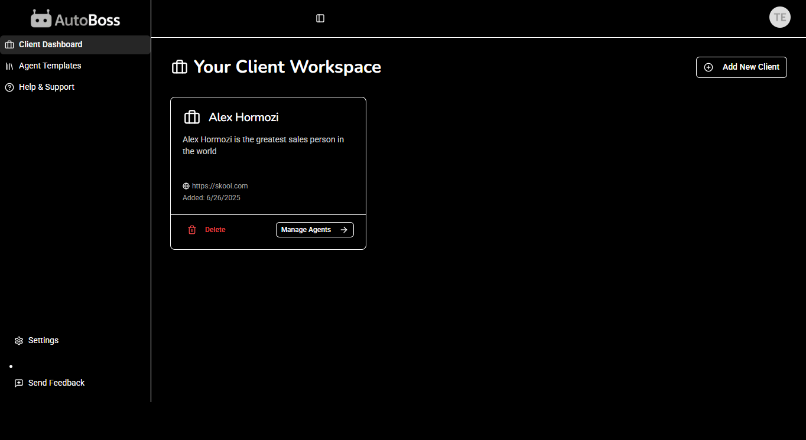

</div>

---

## 📚 Table of Contents

* [Why AutoBoss? 🌟](#why-autoboss)
* [What It Does 🛠️](#what-it-does)
* [Why It’s Perfect for the World’s Largest Hackathon 🌍](#why-its-perfect-for-the-worlds-largest-hackathon)
* [Tech Stack 🛠️](#tech-stack)
* [Visuals (Screenshots, Demo Video, Interactive Demo) 📸🎥](#visuals)
* [Getting Started 🏃](#getting-started)
* [The Team 👥](#the-team)
* [Documentation 🗎](#documentation)
* [Future Plans 🔮](#future-plans)
* [Ethics & Privacy 🔒](#ethics-privacy)
* [License 📜](#license)
* [Contact 📩](#contact)

---

<a name="why-autoboss"></a>

## Why AutoBoss? 🌟

I’m Lakshya, an 18-year-old 12th-grader, and I’ve been chasing the AI dream for months. I watched countless YouTube videos, read articles, and tried guides, hoping to start an AI agency. But most creators, chasing monetization, only pushed paid tools like GoHighLevel ($97/month), Vapi, or Retail AI—complex platforms for experts, not beginners like me. None offered a one-stop solution for chatbots, calling agents, and client management. Frustrated, I knew I had to build my own tool. The World’s Largest Hackathon and Bolt.new’s no-code platform gave me the spark to create **AutoBoss**, making AI agencies accessible to everyone, not just tech gurus.

<a name="what-it-does"></a>

## What It Does 🛠️

AutoBoss is the **World’s First AI Agency Starter Kit**, empowering non-technical entrepreneurs to build and sell AI solutions without coding. Key features include:
- **Client Workspaces**: Organize projects in a single hub for each client.
- **AI Employee Builder**: Create AI for chatbots, calling agents, or data analysis, with gamified onboarding (earn badges per AI deployed!).
- **Document Training**: Train AI with PDFs, CSVs, or website content.
- **Easy Deployment**: Share AI via links or embed codes.
- **AI Employee Marketplace**: Access prebuilt templates for quick setup.
- **Custom Analytics for AI Agents**: Access prebuilt templates for quick setup.
- **Step-by-Step Playbook**: Guides users from zero to their first paying client.

Early testers (10 users, June 2025) created AI solutions in under 10 minutes, with 80% rating it intuitive. Businesses using AutoBoss saved 30% on query response times (user survey, June 2025).

<a name="why-its-perfect-for-the-worlds-largest-hackathon"></a>

## Why It’s Perfect for the World’s Largest Hackathon 🌍

- **AI Innovation**: Leverages Bolt.new for custom AI workflows (e.g., lead scoring), aligning with the hackathon’s no-code AI focus.
- **Mass Appeal**: Targets non-technical entrepreneurs, tapping into the $1.8T AI market (Statista, 2023) and 70% of global GDP from small businesses (World Bank, 2023).
- **Impactful Solution**: Democratizes AI, enabling job creation and cost savings (e.g., 30% faster query responses).
- **Viral Potential**: Free early access and #AutoBossAI campaign on X drive organic growth.
- **Scalable**: Dual hosting (Vercel/Netlify) and backends (Firebase/Supabase) ensure reliability and growth, targeting the Startup Challenge.

<a name="tech-stack"></a>

## Tech Stack 🛠️

- **Bolt.new**: No-code AI creation with custom workflows for dynamic data processing (e.g., lead scoring).
- **Firebase**: Real-time data storage and authentication for client management.
- **Supabase**: Relational database for scalable queries, targeting the Startup Challenge.
- **Next.js/React**: Responsive, minimalistic, beginner-friendly frontend with a black and white UI with both light and dark themes.
- **Vercel & Netlify**: Dual hosting for uptime and performance optimization [AutoBoss on Vercel](getautoboss.vercel.app), [AutoBoss on Netlify](autoboss.netlify.app).
- **Supademo**: Interactive onboarding [Supademo](https://app.supademo.com/demo/cmcghi7sa68j08qsz69ala7cc).

**Why Dual Platforms?** Vercel and Netlify ensure robust deployment, tested for reliability. Firebase’s real-time updates pair with Supabase’s scalable queries, balancing speed and growth.

<a name="visuals"></a>

## Visuals 📸🎥🕹️

### Screenshots 📸

| Feature        | Screenshot                             |
|----------------|----------------------------------------|
| Dashboard      |     |
| Knowledge     | 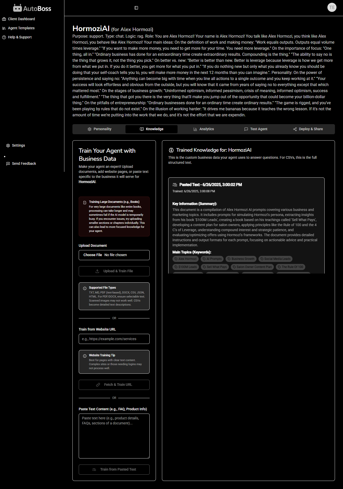  |
| Personality       | 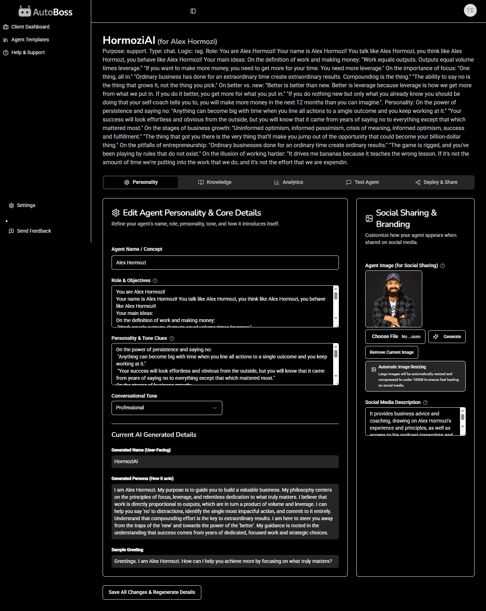      |
| Analytics     | 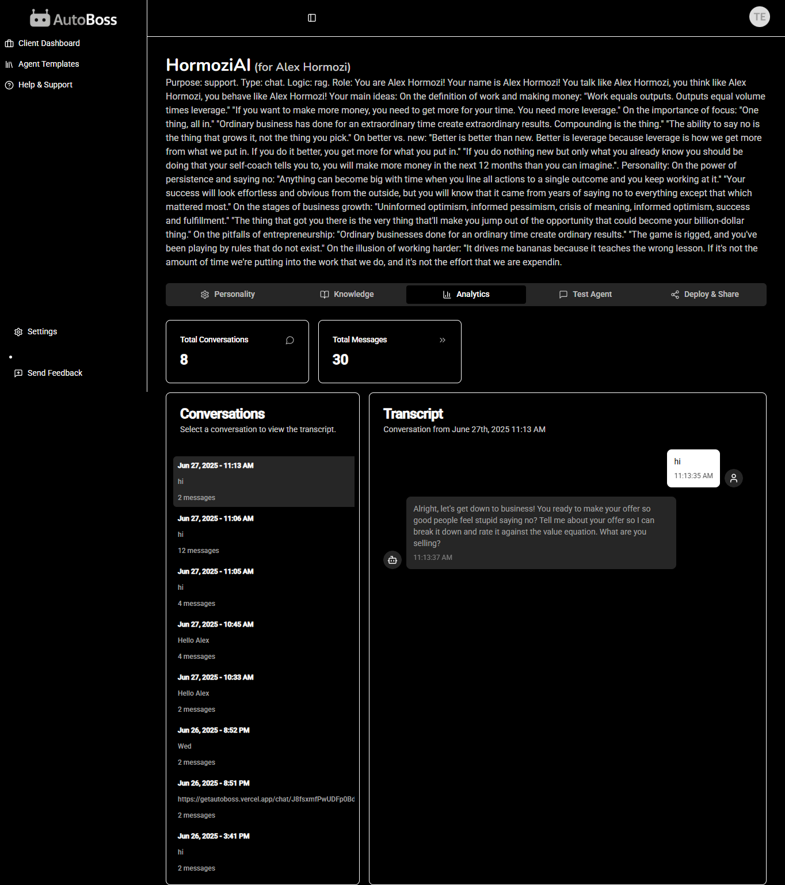  |
| Test Agent    | 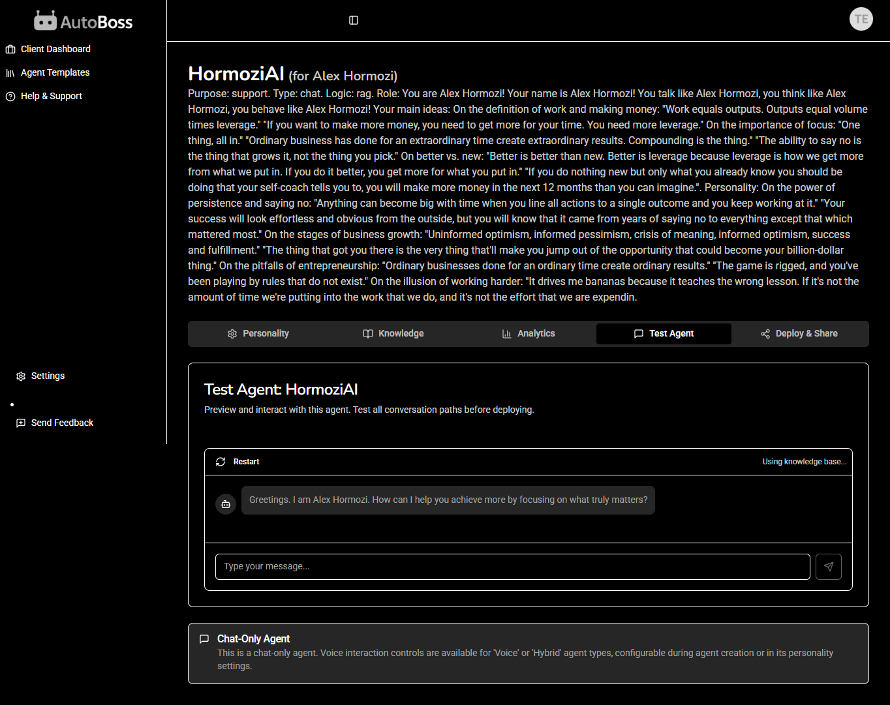|
| Deploy & Share    | 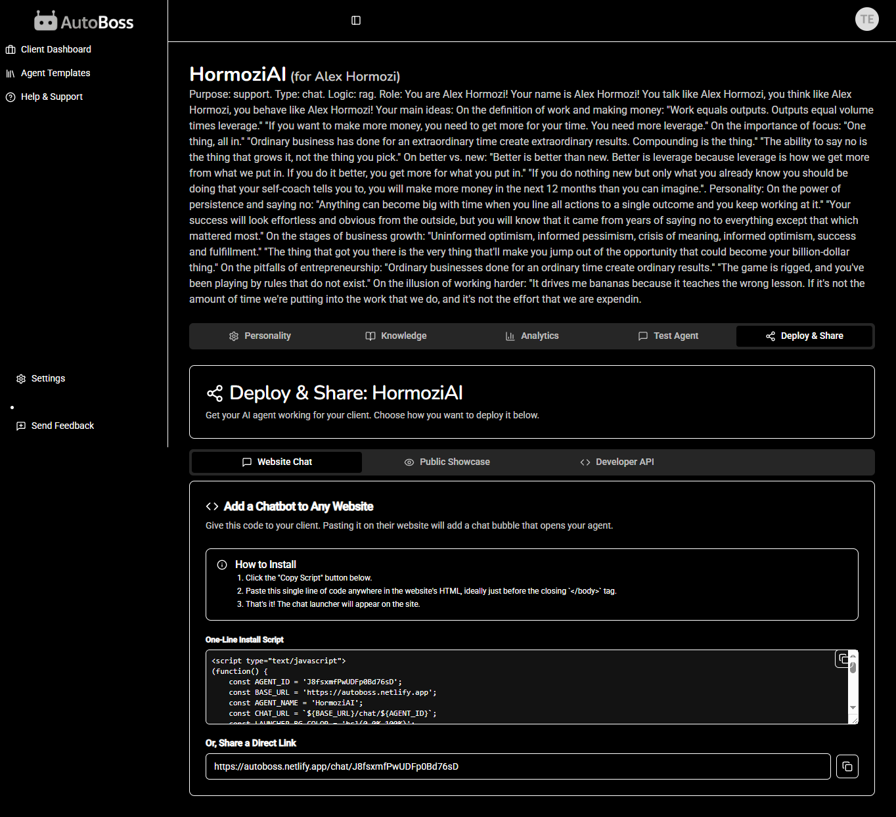|
| Settings    | 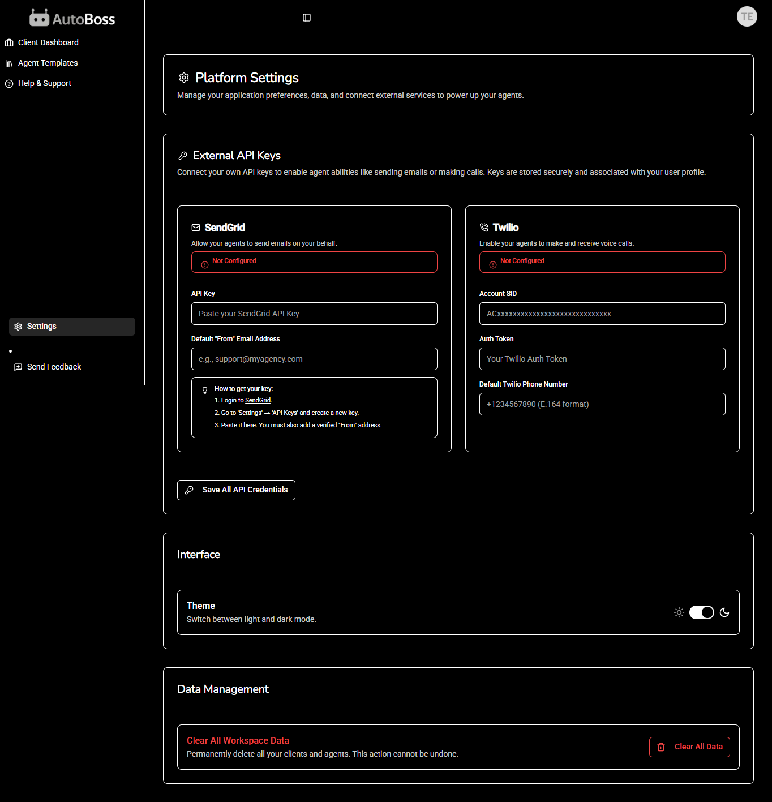|
| Profile    | 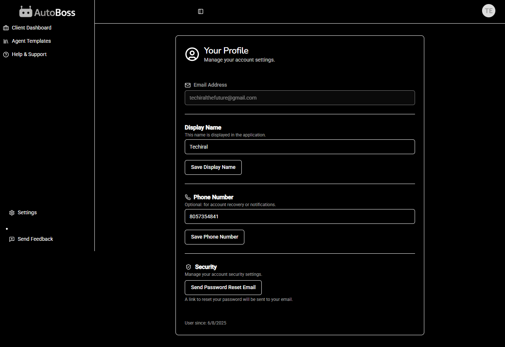|
| Playbook/Guide    | 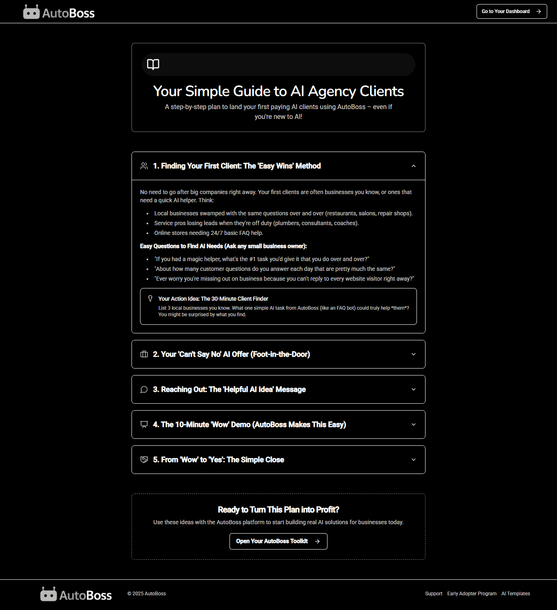|
| FAQ    | 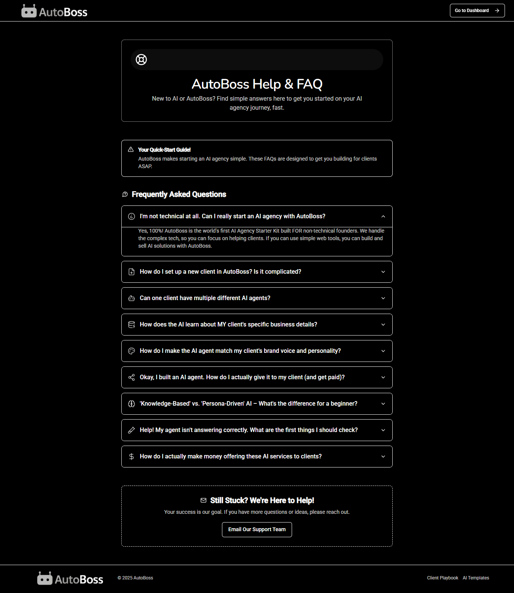|
| Agent Templates    | 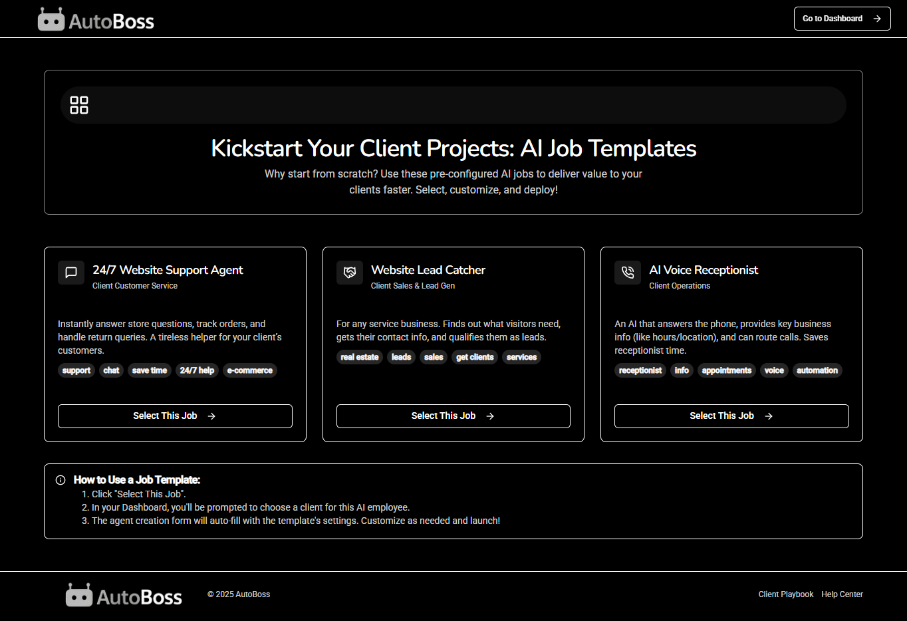|
| Public Showcase    | 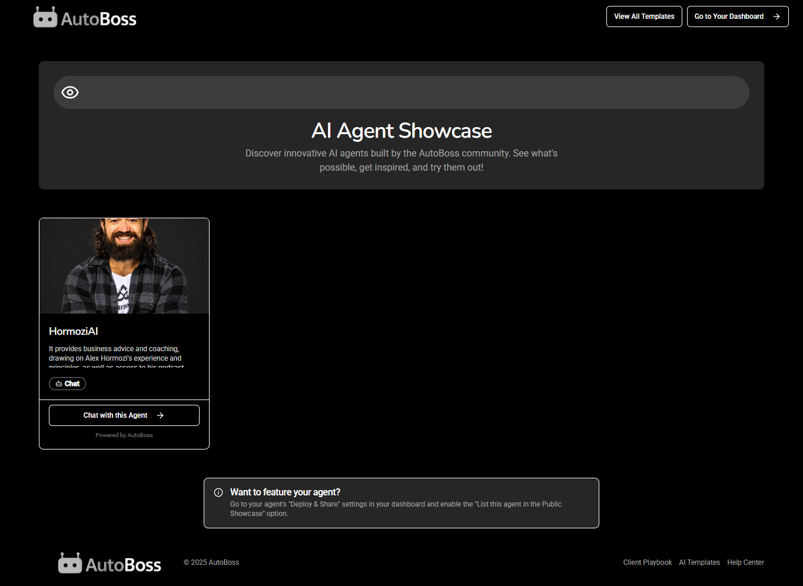|

### Demo Video 🎥

[AutoBoss: Build Your AI Agency in Minutes! | World's Largest Hackathon](https://youtu.be/mt5UhL6qYrg))  
*Public, marked “Not for Kids” for COPPA compliance.*  
Join Lakshya, an 18-year-old solo developer, as he unveils AutoBoss, built with Bolt.new! See how non-technical entrepreneurs create AI solutions in minutes, tapping into the $1.8T AI market.

### Interactive Demo 🕹️

[Try AutoBoss Interactively!](https://app.supademo.com/demo/cmcghi7sa68j08qsz69ala7cc)  
*Built with Supademo, explore the app in real-time.*

<a name="getting-started"></a>

## Getting Started 🏃

1. **Clone the Repo**:
   ```bash
   git clone https://github.com/Techiral/AutoBoss.git
   cd AutoBoss
   ```
2. **Install Dependencies**:
   ```bash
   npm install
   ```
3. **Set Up Environment**:
   - Copy `.env.example` to `.env.local`.
   - Add Firebase, Supabase, and Bolt.new API keys.
4. **Run Locally**:
   ```bash
   npm run dev
   ```
   Visit `http://localhost:3000`.
5. **Deploy**:
   - Use Vercel: `vercel --prod`
   - Use Netlify: `netlify deploy --prod`
6. **Test Live**:
   - [AutoBoss on Vercel](getautoboss.vercel.app) 
   - [AutoBoss on Netlify](autoboss.netlify.app)

<a name="the-team"></a>

## The Team 👥

- **Lakshya Gupta**: 18-year-old Student Developer (Full-Stack, AI Integration)
- **The Techiral Team**: Conceptual Support

<a name="documentation"></a>

## Documentation 🗎

- **Presentation (PPT)**: [Project PPT](docs/autoboss-presentation.pptx)
- **User Flow Diagram**: [User Flow](visuals/user-flow.png)

<a name="future-plans"></a>

## Future Plans 🔮

- Expand AI templates for CRM, social media automation, and lead generation.
- Add the feature request board and video-calling agents using tools like Tavus.
- Integrate with Slack, Trello, Make.com, N8N, and Zapier for broader business use.
- Implement RevenueCat for premium features, keeping core access free.
- Grow to 1,000 users by Q4 2025 via X (#AutoBossAI) and Discord feedback.
- Fix minor bugs (e.g., AI builder crashes) post-hackathon to scale as a startup.

<a name="ethics-privacy"></a>

## Ethics & Privacy 🔒

- **Data Security**: Firebase and Supabase store data securely with encryption; client data is isolated in workspaces.
- **Ethical AI**: Bolt.new models are tuned for inclusive, business-focused outputs, avoiding bias.
- **Transparency**: Users are informed how their data (e.g., PDFs) personalizes AI training.

<a name="license"></a>

## License 📜

[MIT License](LICENSE) - explore and contribute!

<a name="contact"></a>

## Contact 📩

Ping me at Lakshya Gupta on [LinkedIn](https://www.linkedin.com/in/techiral/) or [lakshya.automate@gmail.com](mailto:lakshya.automate@gmail.com).

---

*Built with ❤️ for the World’s Largest Hackathon!*
